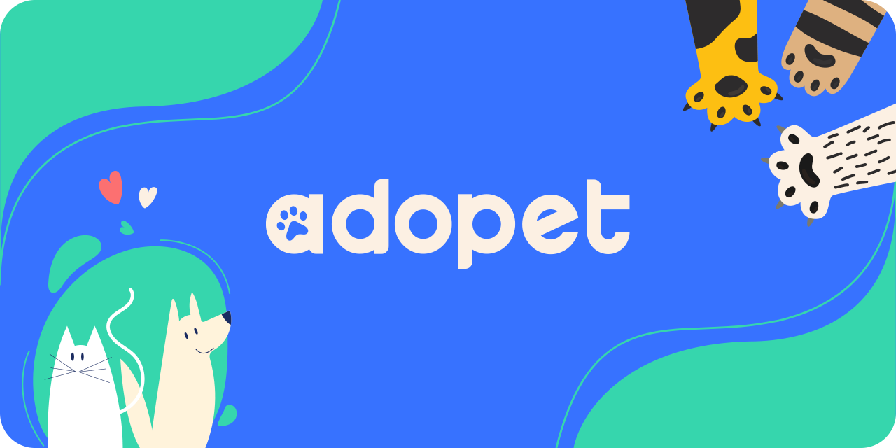

<h1 align="center"> 🐕 Adopet 🐈 </h1>


## 📑 Table of Contents

- [📑 Table of Contents](#-table-of-contents)
- [📖 Overview](#-overview)
- [🛠️ Technologies](#-technologies)
- [⚡ Performance & PWA](#-performance--pwa)
- [🚀 Demo](#-demo)
- [📦 Install and Use](#-install-and-use)
- [📂 File Structure](#-file-structure)
- [🎨 Reference & Inspiration](#-reference--inspiration)
- [👨‍💻 Author and Contact](#%E2%80%8D-author-and-contact)

## 📖 Overview

Adopet is a streamlined web platform created to facilitate the connection between animal rescue organizations and individuals looking to adopt pets. This repository contains the static frontend implementation of the application, structured for rapid development, accessibility, and clean code organization.

## 🛠 Technologies

The following technologies were used to build this project:

- [HTML5](https://developer.mozilla.org/en-US/docs/Web/HTML)
- [CSS3](https://developer.mozilla.org/en-US/docs/Web/CSS)
- [Javascript](https://developer.mozilla.org/en-US/docs/Web/JavaScript)

## ⚡ Performance & PWA

Coming Soon!

## 🚀 Demo

Access the live application below to interact with the interface and run your own performance tests

Adopet: [https://adopet-plum.vercel.app/](https://adopet-plum.vercel.app/)

### Desktop
[desktop.mp4](https://github.com/user-attachments/assets/737f4718-bb20-4473-ade7-557617f57427)

### Mobile
[mobile.mp4](https://github.com/user-attachments/assets/b7c6794a-2f3c-47b7-b1fc-924c28e9f65c)

## 📦 Install and Use

This project currently operates without a local development server or build step, meaning it can be run directly from your file system.

1. Clone the repository:
```bash
git clone https://github.com/Epiled/adopet.git
cd adopet
```

2. Install the dependencies:
```bash
npm install
```

3. Run the development environment (Build + Watch + Server):
```bash
npm run dev
```

## 📂 File Structure

Below is the project architecture. All development should be done inside the src/ folder

```
adopet/
├── design/                  # Wireframes, videos and assets for documentation
├── src/                     # Main source code (Development)
│   ├── assets/              # Original images and icons
│   ├── css/                 # Styles following architecture BEM
│   └── js/                  # UI logic and PWA registration
├── index.html               # Base semantic structure and main markup
└── package.json             # Project dependencies and npm scripts
```

## 🎨 Reference & Inspiration

The project's design and wireframes are available for viewing on Figma. Below is a list of the real-world examples that inspired the UI/UX design.

Figma / Wireframe: [Adopet](https://www.figma.com/design/onpZvSTZ8jnNmuZQ5KW7YI/Challenge-Front-end-%7C-Adopet--Community-?node-id=518-11&t=dojyhrCm0TKEecn8-1)

## 👨‍💻 Author and Contact

<a href="https://github.com/Epiled">
  
  <br />
  <sub><b>Felipe De Andrade</b></sub>
</a>

Made with ❤️ by Felipe De Andrade 👋🏽 Get in touch!

[](https://www.linkedin.com/in/fademendonca/)
[](https://codepen.io/epiled)
[](mailto:felipe.deam98@gmail.com)
