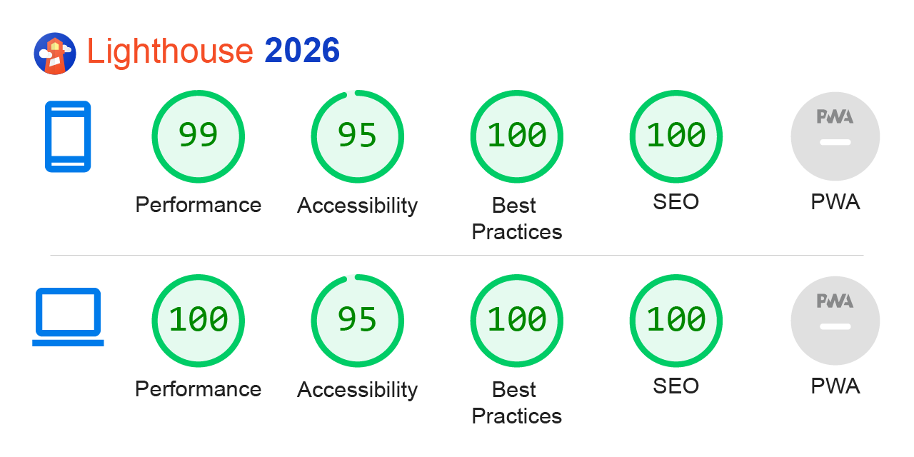

<h1 align="center"> 🐕 Adopet 🐈 </h1>


## 📑 Table of Contents

- [📑 Table of Contents](#-table-of-contents)
- [📖 Overview](#-overview)
- [🛠️ Technologies](#-technologies)
- [🧪 Testing](#-testing)
- [⚡ Performance & PWA](#-performance--pwa)
- [🚀 Demo](#-demo)
- [📦 Install and Use](#-install-and-use)
- [📂 File Structure](#-file-structure)
- [🎨 Reference & Inspiration](#-reference--inspiration)
- [👨‍💻 Author and Contact](#%E2%80%8D-author-and-contact)

## 📖 Overview

Adopet is a web platform designed to connect people interested in pet adoption with animals looking for a new home.

The project was developed with a focus on accessibility, responsive design, clean code organization, and realistic user flows.

It includes simulated authentication, user registration, profile management, pet listing, form validation, and automated tests using a localStorage-based mock database.

## 🛠 Technologies

The following technologies were used to build this project:

- [HTML5](https://developer.mozilla.org/en-US/docs/Web/HTML)
- [CSS3](https://developer.mozilla.org/en-US/docs/Web/CSS)
- [JavaScript](https://developer.mozilla.org/en-US/docs/Web/JavaScript)
- [Vitest](https://vitest.dev/)
- [jsdom](https://github.com/jsdom/jsdom)
- [ESLint](https://eslint.org/)
- [BrowserSync](https://browsersync.io/)
- [LocalStorage](https://developer.mozilla.org/en-US/docs/Web/API/Window/localStorage)

## ⚡ Performance & PWA



## 🧪 Testing

The project uses [Vitest](https://vitest.dev/) with jsdom for automated testing.

The test suite covers:

- Form validation
- Authentication guards
- Database initialization
- Login flow
- Registration flow
- Profile updates
- Phone number masking

Run the test suite with:

```bash
npm run test:run
```

## 🚀 Demo

Access the live application below to interact with the interface and run your own performance tests.

Adopet: [https://adopet-plum.vercel.app/](https://adopet-plum.vercel.app/)

### Desktop
[desktop.webm](https://github.com/user-attachments/assets/737f4718-bb20-4473-ade7-557617f57427)

### Mobile
[mobile..webm](https://github.com/user-attachments/assets/b7c6794a-2f3c-47b7-b1fc-924c28e9f65c)

## 📦 Install and Use

**Prerequisites:** Node.js (v22.x) or higher installed.

1. Clone the repository:
```bash
git clone https://github.com/Epiled/adopet.git
cd adopet
```

2. Install the dependencies:
```bash
npm install
```

3. Run the development environment (Build + Watch + Server):
```bash
npm run dev
```

4. Run the tests:
```bash
npm run test:run
```

5. Run ESLint:

```bash
npm run lint
```

## 📂 File Structure

Below is the project architecture. All development should be done inside the src/ folder

```
adopet/
├── design/                  # Wireframes, videos and assets for documentation
├── src/                     # Main source code (Development)
│   ├── assets/              # Original images and icons
│   ├── css/                 # Styles following architecture BEM
│   ├── js/                  # Application logic
│   │   ├── mocks/           # Simulated database
│   │   └── validation/      # Form validation
│   └── *.html               # Application pages
├── tests/
│   ├── helpers/             # Test utilities
│   └── *.test.js            # Automated tests
└── package.json             # Project dependencies and npm scripts
```

## 🎨 Reference & Inspiration

The project's design and wireframes are available for viewing on Figma. Below is a list of the real-world examples that inspired the UI/UX design.

Figma / Wireframe: [Adopet](https://www.figma.com/design/onpZvSTZ8jnNmuZQ5KW7YI/Challenge-Front-end-%7C-Adopet--Community-?node-id=518-11&t=dojyhrCm0TKEecn8-1)

## 👨‍💻 Author and Contact

<a href="https://github.com/Epiled">
  
  <br />
  <sub><b>Felipe De Andrade</b></sub>
</a>

Made with ❤️ by Felipe De Andrade 👋🏽 Get in touch!

[](https://www.linkedin.com/in/fademendonca/)
[](https://codepen.io/epiled)
[](mailto:felipe.deam98@gmail.com)
